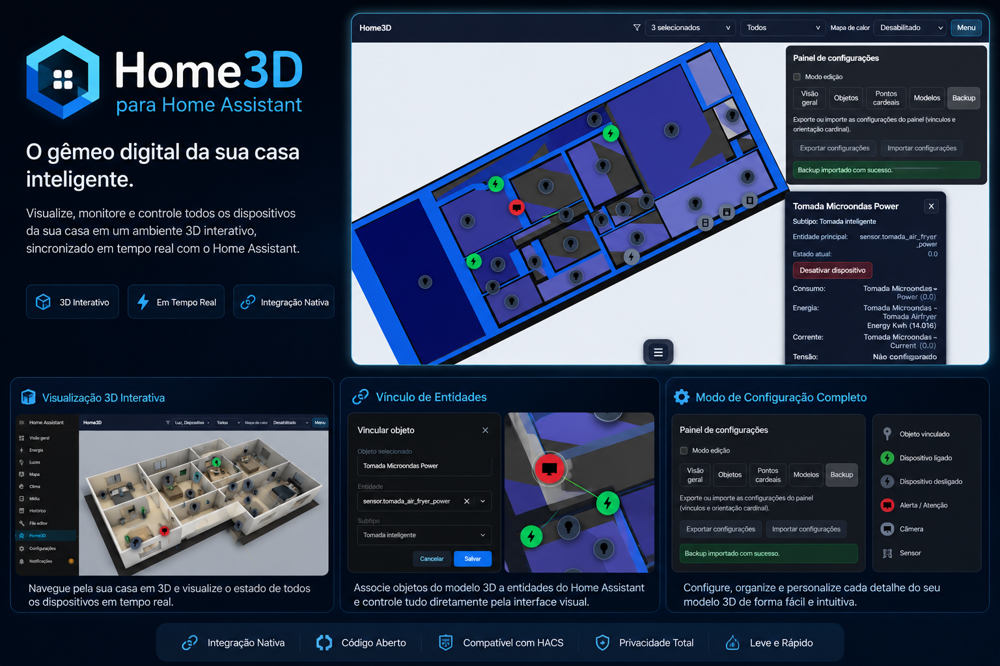

# Home3D para Home Assistant



<p align="center">

**A próxima geração de interface visual para o Home Assistant.**

Visualize, monitore e controle toda a sua casa inteligente através de um ambiente 3D interativo sincronizado em tempo real.

</p>

---

# Visão Geral

O Home3D transforma o Home Assistant em um **Gêmeo Digital (Digital Twin)** da sua residência.

Em vez de navegar por dashboards repletos de cartões e entidades, sua própria casa se torna a interface principal.

Cada cômodo, dispositivo, sensor, interruptor, luz e automação pode ser representado em um modelo 3D totalmente interativo, sincronizado em tempo real com o Home Assistant.

Este repositório contém apenas a integração distribuída pelo **HACS**.

O código-fonte completo do projeto está disponível em:

https://github.com/luizsene/casa3d

---

# Nossa Visão

O Home3D não pretende ser apenas mais um dashboard.

Nosso objetivo é criar uma camada visual completa para o Home Assistant, onde a própria casa se torna a interface do sistema.

Imagine poder:

- Acionar uma lâmpada clicando diretamente nela no modelo 3D.
- Visualizar a temperatura de cada ambiente em tempo real.
- Exibir mapas de calor do consumo de energia.
- Visualizar câmeras diretamente dentro da cena.
- Monitorar portas, janelas e sensores instantaneamente.
- Simular automações antes de ativá-las.
- Navegar entre os cômodos e andares da residência como se estivesse caminhando pela casa.

O Home3D busca se tornar o **Gêmeo Digital da sua casa inteligente**.

---

# Recursos

## Recursos atuais

- Integração nativa com Home Assistant
- Painel lateral (Sidebar)
- Fluxo de configuração (Config Flow)
- Suporte a modelos GLB
- Visualizador 3D interativo
- Sistema de vinculação de entidades
- Hospedagem local dos arquivos do modelo
- Comunicação em tempo real via WebSocket
- Gerenciamento de cômodos
- Armazenamento persistente das configurações

---

## Recursos planejados

- Mapas de calor
- Visualização do consumo de energia
- Sobreposição de temperatura
- Sobreposição de umidade
- Efeitos de iluminação
- Integração com câmeras
- Visualização de automações
- Animações de dispositivos
- Mapeamento assistido por IA
- Navegação entre múltiplos andares
- Suporte para Realidade Virtual (VR)
- Modelos prontos de cenas
- Importação de projetos do Floor Planner
- Importação de projetos do Sweet Home 3D

---

# Capturas de Tela

As próximas versões incluirão:

- Visualização completa da residência em 3D
- Sobreposição de estados dos dispositivos
- Visualização integrada de câmeras
- Mapas de calor de energia
- Editor visual de automações
- Navegação entre múltiplos andares

---

# Instalação

## Instalação pelo HACS

1. Abra o **HACS**.
2. Acesse **Integrações**.
3. Procure por:

```
Home3D
```

4. Clique em **Instalar**.
5. Reinicie o Home Assistant.

---

## Instalação Manual

Copie a pasta:

```
custom_components/home3d
```

para:

```
config/custom_components/
```

Reinicie o Home Assistant.

Depois disso, adicione a integração em:

```
Configurações

↓

Dispositivos e Serviços

↓

Adicionar Integração

↓

Home3D
```

---

# Primeira Configuração

Após instalar a integração:

1. Abra o painel **Home3D** na barra lateral.
2. Ative o **Modo de Configuração**.
3. Envie o modelo 3D no formato GLB.
4. Crie os cômodos da residência.
5. Selecione os objetos do modelo.
6. Vincule cada objeto às entidades do Home Assistant.
7. Salve a configuração.

Toda a configuração é armazenada automaticamente.

Nenhuma configuração em YAML é necessária.

---

# Vinculação de Entidades

O sistema de vinculação é o núcleo do Home3D.

Cada objeto do modelo 3D pode ser associado a uma ou mais entidades do Home Assistant.

Exemplos:

**Lâmpada da Sala**

↓

light.sala

**Temperatura do Quarto**

↓

sensor.temperatura_quarto

**Portão da Garagem**

↓

cover.garagem

**Ar-condicionado**

↓

climate.quarto

**Consumo de Energia**

↓

sensor.energia_total

**Sensor da Porta**

↓

binary_sensor.porta_entrada

Após a vinculação, o estado do objeto é atualizado automaticamente conforme as mudanças no Home Assistant.

---

# Entidades Compatíveis

Atualmente são suportados:

- Luzes
- Interruptores
- Ventiladores
- Persianas e Portões
- Sensores
- Sensores Binários
- Climatização
- Players de mídia
- Câmeras

Novos domínios serão adicionados continuamente.

---

# Modo de Configuração

O Modo de Configuração permite criar a relação entre o modelo 3D e as entidades do Home Assistant.

Recursos atuais:

- Criar cômodos
- Renomear cômodos
- Enviar modelos GLB
- Vincular entidades
- Remover vínculos
- Salvar configurações

Recursos planejados:

- Arrastar e soltar (Drag & Drop)
- Personalização de objetos
- Alteração de cores
- Animações
- Regras de visibilidade
- Modelos reutilizáveis

---

# Modelos 3D

Formato atualmente suportado:

✅ GLB

Fluxo recomendado:

```
Blender

↓

Exportar GLB

↓

Enviar para o Home3D

↓

Vincular entidades

↓

Pronto
```

Futuramente serão suportados:

- Sweet Home 3D
- Floor Planner
- SketchUp
- Revit

---

# Integração com o Home Assistant

O Home3D utiliza exclusivamente APIs nativas do Home Assistant.

Atualmente utiliza:

- Fluxo de Configuração
- WebSocket API
- Chamadas de Serviços
- Registro de Entidades
- Registro de Dispositivos
- Registro de Áreas
- Barramento de Eventos
- Diagnósticos
- Hospedagem de Arquivos Estáticos

Toda a renderização acontece no navegador.

Isso mantém o Home Assistant leve enquanto permite cenas 3D complexas.

---

# Arquitetura

A integração do Home Assistant é propositalmente simples.

Ela é responsável por:

- Registrar o painel lateral
- Armazenar configurações
- Disponibilizar endpoints WebSocket
- Servir arquivos estáticos
- Gerenciar vínculos entre objetos e entidades
- Registrar serviços
- Disponibilizar diagnósticos

Todo o motor gráfico é executado no navegador.

---

# Desempenho

Projetado para funcionar em:

- Home Assistant OS
- Home Assistant Container
- Home Assistant Supervised
- Home Assistant Green
- Home Assistant Yellow
- Raspberry Pi

A renderização utiliza aceleração por GPU via WebGL.

O servidor Home Assistant fica responsável apenas pela sincronização das informações.

---

# Roadmap

## Fase 1

- Estrutura do projeto
- Visualizador 3D
- Integração com Home Assistant
- Sistema de vinculação
- Modo de configuração

---

## Fase 2

- Sincronização completa da cena
- Gerenciador de câmeras
- Gerenciador de dispositivos
- Mapas de calor
- Visualização de consumo
- Sobreposição de temperatura

---

## Fase 3

- Editor visual de automações
- Assistente com Inteligência Artificial
- Controle por voz
- Simulação completa do Gêmeo Digital
- Modelos prontos de cena
- Navegação entre múltiplos andares

---

# Desenvolvimento

Este repositório contém apenas a integração distribuída pelo HACS.

O desenvolvimento completo acontece no repositório:

https://github.com/luizsene/casa3d

O projeto segue os princípios:

- SOLID
- Clean Architecture
- Interface First
- Nx Workspace
- TypeScript
- React

---

# Contribuindo

Contribuições são muito bem-vindas.

Relatos de bugs, sugestões e Pull Requests devem ser enviados para o repositório principal do projeto:

https://github.com/luizsene/casa3d

---

# Licença

Distribuído sob a licença **MIT**.

Consulte o arquivo **LICENSE** para mais informações.

---------------------------------------------------------------------------
# Home3D for Home Assistant

<p align="center">

Interactive 3D Digital Twin for Home Assistant

Visualize, monitor and control your entire smart home through a real-time 3D environment.

</p>

---

## Overview

Home3D transforms Home Assistant into a real-time digital twin of your home.

Instead of navigating through dashboards full of cards, Home3D allows your entire house to become the user interface.

Every room, device, light, sensor, switch and automation can be represented inside a fully interactive 3D model synchronized with Home Assistant in real time.

This repository contains only the Home Assistant integration distributed through HACS.

The complete development workspace is available at:

https://github.com/luizsene/casa3d

---

## Vision

Home3D is not intended to be "just another dashboard."

The long-term goal is to create a complete visual layer for Home Assistant where your home itself becomes the interface.

Imagine being able to:

• Click a lamp inside the 3D model to turn it on.

• Watch temperature change in each room.

• Visualize power consumption as a heat map.

• Display live camera feeds directly inside the scene.

• Monitor doors, windows and alarms in real time.

• Simulate automations before enabling them.

• Navigate through floors as if walking inside your home.

Home3D aims to become the Digital Twin of your smart home.

---

# Features

## Current

✔ Native Home Assistant Integration

✔ Sidebar Panel

✔ Configuration Flow

✔ GLB Model Support

✔ Interactive 3D Viewer

✔ Entity Binding System

✔ Local Asset Hosting

✔ Home Assistant WebSocket Integration

✔ Room Management

✔ Persistent Binding Storage

---

## Planned

• Heat Maps

• Energy Visualization

• Temperature Overlay

• Humidity Overlay

• Lighting Effects

• Camera Integration

• Automation Visualization

• Device Animations

• AI Assisted Mapping

• Multi-floor Navigation

• VR Support

• Scene Templates

• Floor Planner Import

• Sweet Home 3D Import

---

# Screens

Future releases will include:

- Interactive house visualization

- Device overlays

- Camera integration

- Energy heat maps

- Automation editor

- Multi-floor navigation

---

# Installation

## Install using HACS

1. Open HACS.

2. Integrations.

3. Search for:

```
Home3D
```

4. Install.

5. Restart Home Assistant.

---

## Manual Installation

Copy

```
custom_components/home3d
```

into

```
config/custom_components/
```

Restart Home Assistant.

Then add the integration from:

Settings

↓

Devices & Services

↓

Add Integration

↓

Home3D

---

# First Setup

After installing the integration:

1. Open Home3D from the sidebar.

2. Enable Configuration Mode.

3. Upload your GLB model.

4. Create rooms.

5. Select objects inside the model.

6. Link each object to Home Assistant entities.

7. Save.

The configuration is stored automatically by the integration.

No YAML configuration is required.

---

# Entity Binding

The Entity Binding System is the core of Home3D.

Every object inside the 3D scene can be connected to one or multiple Home Assistant entities.

Examples

Living Room Lamp

↓

light.living_room

Bedroom Temperature

↓

sensor.bedroom_temperature

Garage Door

↓

cover.garage

Bedroom Air Conditioner

↓

climate.bedroom

Energy Consumption

↓

sensor.house_energy

Door Sensor

↓

binary_sensor.front_door

Once linked, the object automatically reflects the current Home Assistant state.

---

# Supported Entity Domains

Current support includes:

- Light

- Switch

- Fan

- Cover

- Sensor

- Binary Sensor

- Climate

- Media Player

- Camera

Additional domains will be added over time.

---

# Configuration Mode

Configuration Mode allows users to build the relationship between the 3D model and Home Assistant.

Current capabilities

• Create rooms

• Rename rooms

• Upload GLB models

• Link entities

• Remove links

• Save configuration

Future versions will also support:

• Drag & Drop editing

• Object properties

• Color customization

• Animations

• Visibility rules

• Device templates

---

# 3D Model Support

Current supported format

✔ GLB

Recommended workflow

Blender

↓

Export GLB

↓

Upload into Home3D

↓

Bind entities

↓

Done

Future versions will support importing models from:

• Sweet Home 3D

• Floor Planner

• SketchUp

• Revit

---

# Home Assistant Integration

The integration uses native Home Assistant APIs.

Current communication layers

• Configuration Flow

• WebSocket API

• Service Calls

• Entity Registry

• Device Registry

• Area Registry

• Event Bus

• Diagnostics

• Static Asset Hosting

Rendering is entirely client-side.

This keeps Home Assistant lightweight while allowing complex 3D scenes.

---

# Architecture

The Home Assistant integration is intentionally lightweight.

Its responsibilities are:

• Register the sidebar panel

• Store configuration

• Provide WebSocket endpoints

• Serve static assets

• Manage entity bindings

• Register services

• Diagnostics

The 3D engine runs completely in the browser.

---

# Performance

Designed to run on:

✔ Home Assistant OS

✔ Home Assistant Container

✔ Home Assistant Supervised

✔ Home Assistant Green

✔ Home Assistant Yellow

✔ Raspberry Pi

Rendering is GPU accelerated using WebGL.

The Home Assistant server only handles synchronization.

---

# Roadmap

## Phase 1

Workspace

Viewer

Home Assistant Integration

Entity Binding

Configuration Mode

---

## Phase 2

Scene Synchronization

Camera Manager

Device Manager

Heat Maps

Energy Overlay

Temperature Overlay

---

## Phase 3

Automation Designer

AI Assistant

Voice Interaction

Digital Twin Simulation

Scene Templates

Multi-floor Navigation

---

## Development

This repository contains only the Home Assistant runtime.

The complete development workspace is available at:

https://github.com/luizsene/casa3d

Development follows:

- SOLID

- Clean Architecture

- Interface-first Design

- Nx Workspace

- TypeScript

- React

---

# Contributing

Contributions are welcome.

Bug reports, feature requests and pull requests should be opened in the development repository.

https://github.com/luizsene/casa3d

---

# License

MIT License

See LICENSE for details.